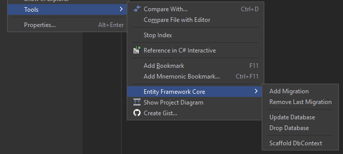
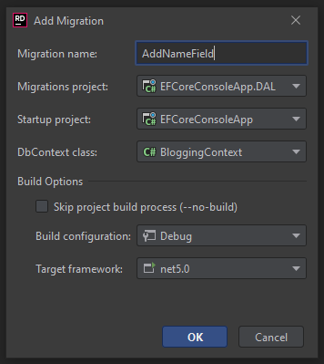
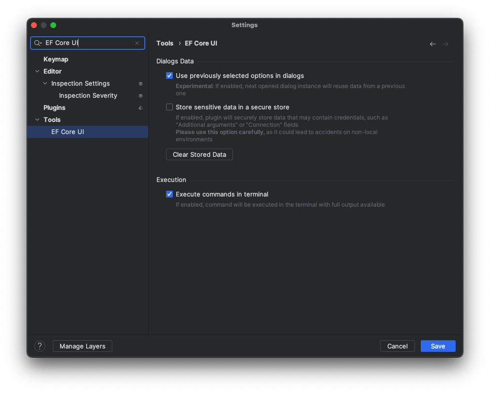

# Entity Framework Core UI plugin for JetBrains Rider

---

This plugin introduces Entity Framework Core commands' UI inside JetBrains Rider.

### Features

There are a couple of UI stuff for:
- Creating migrations
- Updating database with selected migration (including migration names autocompletion)
- Removing last created migration
- Suggesting installing `dotnet ef` command line tools if not installed (when opening solution that contains EF Core related projects)
- Persisting selected migrations and startup projects between dialogs

### How to install

#### Using marketplace:
> **For EAP users**: you should add `https://plugins.jetbrains.com/plugins/eap/list` to your plugin repositories list before installing

1. Go to `Settings` / `Plugins` / `Marketplace`
1. Search for "Entity Framework Core UI"
1. Click `Install`, then `Save`
1. After saving restart Rider

#### Using `.zip` file
1. Go to [**Releases**](https://github.com/seclerp/rider-efcore/releases)
2. Download the latest release of plugin for your edition of JetBrains Rider (Stable or EAP)
3. Proceed to `Settings` / `Plugins` / `⚙` / `Install plugin from disk`
4. Click `Save`
5. After saving restart Rider

### How to use

1. Open solution that contains EF Core related projects (migrations and startup projects)
2. Navigate to <kbd>Tools</kbd>/<kbd>Entity Framework Core</kbd> under project context menu:

   

   You could use context menu of either your migrations or startup project.
3. Clicking action will show appropriate dialog:

   
4. After you press <kbd>Ok</kbd>, selected action will be executed in background:

   

   

More about features and available dialogs you could read in [**the blog post**](TODO).

### Requirements

- JetBrains Rider **2021.2.***

  or JetBrains Rider **2021.3 EAP10**

- EF Core **5.0+** with projects under `net5.0` or `net6.0` target framework

- EF Core global tools (`dotnet ef`) **5.0+** installed

### Development

> **Note**: You should have JDK 11 and .NET SDK 5.0+ installed and configured.

#### Preparing

`./gradlew rdgen` - generates RD protocol data for plugin internal communication

#### Building plugin parts

- for stable version of Rider:

  `./gradlew buildPlugin`

- for EAP version of Rider:

  `./gradlew buildPlugin -PRiderSdkVersion=2021.3.0-eap10 -PProductVersion=2021.3-EAP10-SNAPSHOT`

It will build both frontend and backend parts.

#### Running

Next command will start instance of JetBrains Rider with plugin attached to it:

`./gradlew runIde`

### Contributing

Contributions are welcome! 🎉

It's better to create an issue with description of your bug/feature before creating pull requests.

#### About branching

This project uses modified version of **trunk-based git strategy**.

- `develop` branch play main development branch role. When creating any feature or bugfix, please make your branch from `develop`.

- `master` branch stands for stable releases. `develop` branch will be merged into it before every release.
- `eap` branch stands for EAP release. `develop` branch will be also merged into it before every release (if EAP build of Rider is available to use)

### See also

- [**Changelog**](CHANGELOG.md)
- [**Roadmap**](docs/ROADMAP.md)
- [**Working with Entity Framework Core inside JetBrains Rider**](TODO)