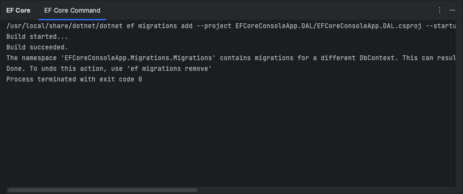

# JetBrains Rider plugin for Entity Framework Core

---

This plugin introduces support for Entity Framework Core inside JetBrains Rider.

### Features

There are a couple of UI stuff for:
- Creating migrations
- Updating database with selected migration (including migration names autocompletion)
- Removing last created migration
- Suggesting installing `dotnet ef` command line tools if not installed (when opening solution that contains EF Core related projects)
- Persisting selected migrations and startup projects between dialogs

### How to install

**TODO**

### How to use

1. Open solution that contains EF Core related projects (migrations and startup projects)
2. Navigate to <kbd>Tools</kbd>/<kbd>Entity Framework Core</kbd> under project context menu:

   

   You could use context menu of either your migrations or startup project.
3. Clicking action will show appropriate dialog:

   
4. After you press <kbd>Ok</kbd>, selected action will be executed in background:

   

   

### Requirements

- JetBrains Rider **2021.2+**
- EF Core **5.0+** with projects under `net5.0` or `net6.0` target framework
- EF Core global tools (`dotnet ef`) **5.0+** installed

### Building

You should have JDK 11 and .NET SDK 5.0+ installed and configured.

Then you could build a plugin with:

`./gradlew buildPlugin`

It will build both frontend and backend parts.

To run JetBrains Rider with plugin:

`./gradlew runIde`

### Contributing

Contributions are welcome!

It's better to create an issue with description of your bug/feature before creating pull requests.

### See also

- [**Changelog**](CHANGELOG.md)
- [**Roadmap**](docs/ROADMAP.md)
