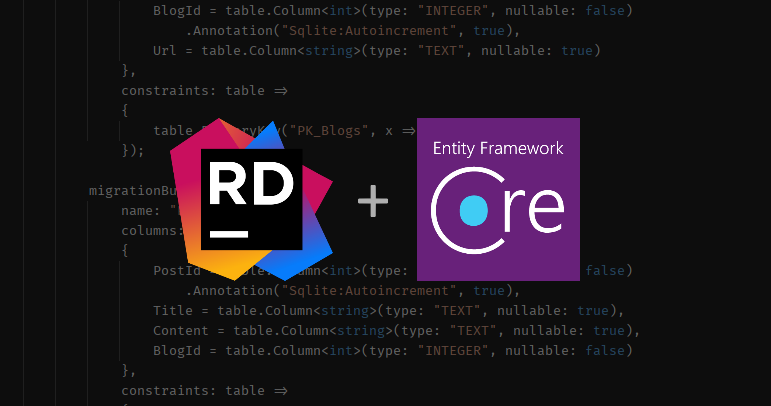
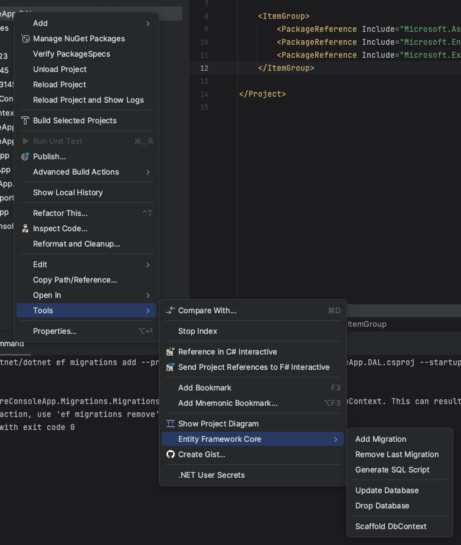
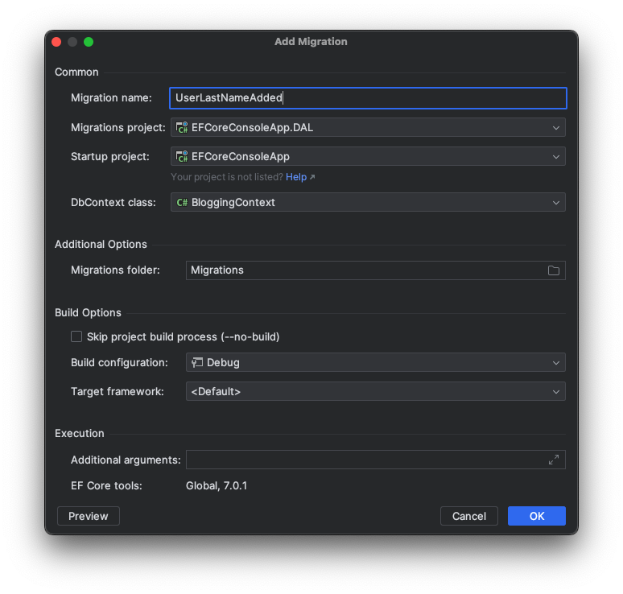

  <h1>Entity Framework Core UI plugin for JetBrains Rider</h1>
  
    
  This plugin introduces Entity Framework Core commands' UI inside JetBrains Rider.
    
  

---

### Features

There are a couple of UI stuff for:
- Creating migrations
- Updating database with selected migration (including migration names autocompletion)
- DbContext scaffolding from existing database
- Creating SQL scripts from the migration range
- Removing last created migration
- Suggesting installing `dotnet ef` command line tools if not installed (when opening solution that contains EF Core related projects)
- Previewing commands before execution
- Persisting selected common preferences between dialogs

### How to install

#### Using marketplace:

1. Go to `Settings` / `Plugins` / `Marketplace`
1. Search for "Entity Framework Core UI"
1. Click `Install`, then `Save`
1. After saving restart Rider

#### Using `.zip` file
1. Go to [**Releases**](https://github.com/seclerp/rider-efcore/releases)
2. Download the latest release of plugin for your edition of JetBrains Rider (Stable or EAP)
3. Proceed to `Settings` / `Plugins` / `⚙` / `Install plugin from disk`
4. Click `Save`
5. After saving restart Rider

### How to use

1. Open solution that contains EF Core related projects (migrations and startup projects)
2. Navigate to <kbd>Tools</kbd>/<kbd>Entity Framework Core</kbd> under project context menu:

   

   You could use context menu of either your migrations or startup project.
3. Clicking action will show appropriate dialog:

   
4. After you press <kbd>Ok</kbd>, selected action will be executed in console-like window (by default):

   

5. You could also configure dialog's behavior in Settings, under <kbd>Tools</kbd>/<kbd>EF Core UI</kbd> section:

   

More about features and available dialogs you could read in [**the blog post**](https://blog.seclerp.me/general/working-with-ef-core-inside-jetbrains-rider/).

### Requirements

#### TL;DR:
- the most recent stable version of **JetBrains Rider**,
- [officially supported](https://dotnet.microsoft.com/en-us/platform/support/policy/dotnet-core#lifecycle) versions of **.NET**, **EF Core tools** and **EF Core NuGets**.

Before opening the issue, please make sure that your projects and development environment completely satisfies these requirements:

- IDE
  - JetBrains Rider **2023.1 or higher**

- Target frameworks
  - `net8.0` (preview)
  - `net7.0`
  - `net6.0`
  - `net5.0`
  - `netcoreapp3.1`
  - `netstandard2.1` <kbd>*</kbd>
  - `netstandard2.0` <kbd>*</kbd>

  <kbd>*</kbd>: only for Migrations projects

- `Microsoft.EntityFrameworkCore.*`: **5.0.0 or higher**

- Tools (`dotnet ef`): **5.0 or higher**

### Development

> **Note**: You should have JDK 17 and .NET SDK 7.0+ installed and configured.

#### Preparing

`./gradlew rdgen` - generates RD protocol data for plugin internal communication

#### Building plugin parts

`./gradlew buildPlugin`

It will build both frontend and backend parts.

#### Running

Next command will start instance of JetBrains Rider with plugin attached to it:

`./gradlew runIde`

### Contributing

Contributions are welcome! 🎉

It's better to create an issue with description of your bug/feature before creating pull requests.

#### About branching

This project uses customized git strategy.

Each `release/*` branch plays main development branch role for specific release.

For example, `release/222` means that branch is related to `222.*` release cycle for `2022.2` Rider version.

### See also

- [**Entity Framework Core inside Rider: UI Way**](https://blog.jetbrains.com/dotnet/2022/01/31/entity-framework-core-inside-rider-ui-way/) _(recommended tutorial)_
- [**Marketplace page**](https://plugins.jetbrains.com/plugin/18147-entity-framework-core-ui)
- [**Changelog**](CHANGELOG.md)
